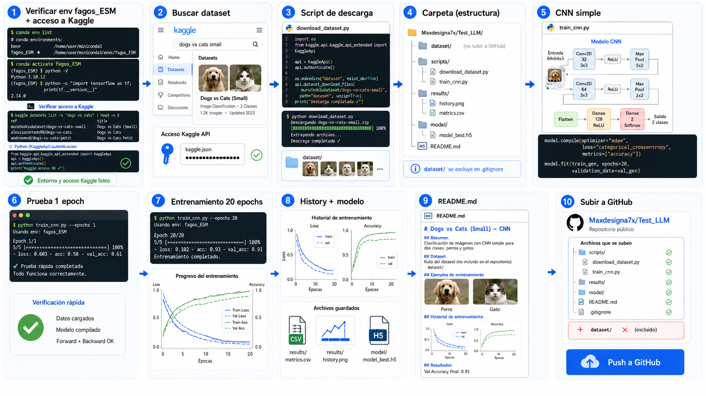
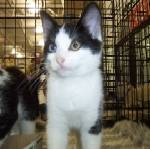
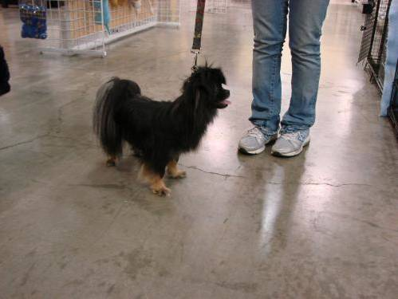
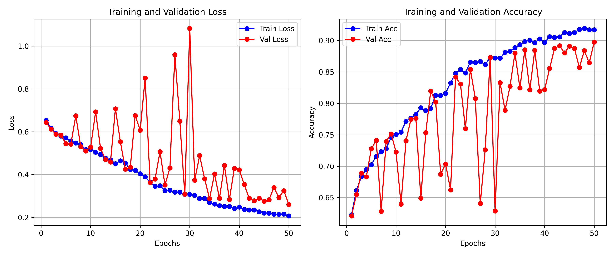

# CNN Demo: Clasificación de Perros y Gatos desde Cero con PyTorch



Este proyecto implementa una red neuronal convolucional (CNN) personalizada desde cero para clasificar imágenes de perros y gatos utilizando PyTorch. No se utilizaron pesos pre-entrenados, y el modelo incorpora **Global Average Pooling (GAP)** antes del clasificador lineal.

---

## Estructura del Proyecto y Metodología

### 1. Conjunto de Datos (Dataset)
El conjunto de datos utilizado es el famoso dataset de Kaggle: [Cat and Dog](https://www.kaggle.com/datasets/tongpython/cat-and-dog).
* **Ubicación del Dataset en Local:** `dataset/` (contiene `training_set/` y `test_set/`).
* **Ejemplos de las clases en el conjunto de entrenamiento:**

| Clase Gato (cat_sample.jpg) | Clase Perro (dog_sample.jpg) |
| :---: | :---: |
|  |  |

### 2. Arquitectura de la Red CNN (CustomCNN)
La red fue construida completamente desde cero con las siguientes capas:
* **Bloque 1:** Conv2D (3 a 32 filtros, 3x3) -> BatchNorm2d -> ReLU -> MaxPool2d (2x2)
* **Bloque 2:** Conv2D (32 a 64 filtros, 3x3) -> BatchNorm2d -> ReLU -> MaxPool2d (2x2)
* **Bloque 3:** Conv2D (64 a 128 filtros, 3x3) -> BatchNorm2d -> ReLU -> MaxPool2d (2x2)
* **Bloque 4:** Conv2D (128 a 256 filtros, 3x3) -> BatchNorm2d -> ReLU -> MaxPool2d (2x2)
* **Global Average Pooling (GAP):** `AdaptiveAvgPool2d((1, 1))` para reducir las dimensiones espaciales a 1x1 y extraer las características globales más relevantes antes de pasar al clasificador final, lo cual reduce significativamente el número de parámetros de la red y previene el sobreajuste.
* **Clasificador Final:** Capa lineal simple (`nn.Linear(256, 2)`) que produce los logits para las clases "Gato" y "Perro".

---

## Entrenamiento y Resultados

El modelo fue entrenado en una GPU **NVIDIA GeForce RTX 3060** durante **50 épocas** usando el optimizador **AdamW** con decaimiento de peso y un programador de tasa de aprendizaje (`ReduceLROnPlateau`).

### Resultados del Entrenamiento
* **Épocas:** 50
* **Tamaño del Batch:** 128
* **Precisión Final de Validación (Accuracy):** **89.77%**
* **Pérdida Final de Validación (Loss):** **0.2603**

A continuación se muestra el gráfico del historial de pérdida (loss) y precisión (accuracy) durante el entrenamiento:



---

## Cómo Ejecutar el Entrenamiento
Para entrenar el modelo nuevamente, puedes correr el script `train.py` con el entorno de conda `demo`:
```bash
/home/randy/miniconda3/envs/demo/bin/python train.py --epochs 50 --batch_size 128
```
Esto guardará los pesos en `best_model.pth` y generará la imagen `history_plot.png`.
